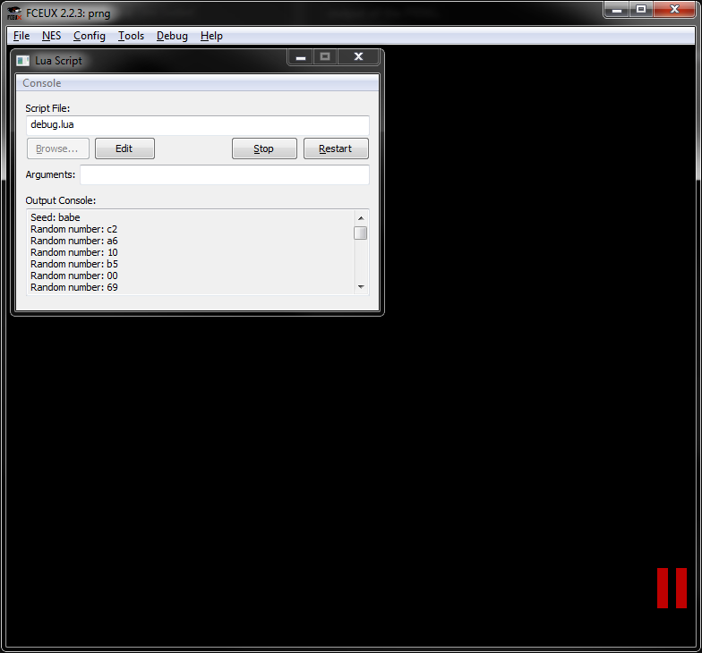

A pseudorandom number generator implemented on the NES using a linear feedback shift register.

Compile by running `make` from this directory.

Run using FCEUX with the included `debug.lua` script to observe the raw output of the PRNG.

Reference: https://wiki.nesdev.com/w/index.php/Random_number_generator