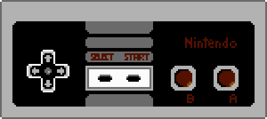

# NES Development

# Tools
* [cc65](https://cc65.github.io/cc65/): A freeware C compiler and 6502 assembler/linker
* [Make (for Windows)](http://gnuwin32.sourceforge.net/packages/make.htm): for running makefiles
* [YY-CHR](https://www.romhacking.net/utilities/119/): For creating/editing sprites and tilesets
* [FCEUX](http://www.fceux.com/): NES emulator w/ extensive debugging capabilities
* [NES Screen Tool](https://shiru.untergrund.net/software.shtml) by Shiru: For laying out backgrounds

To build each example, `cd` to its directory and run `make`.
